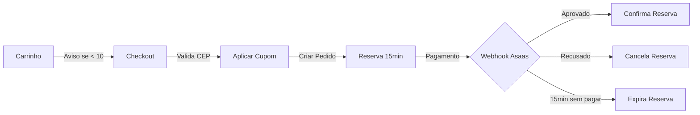

# 📊 RESUMO DA IMPLEMENTAÇÃO - 30/01/2026

## ✅ FUNCIONALIDADES IMPLEMENTADAS

### 1. **ESTRATÉGIA HÍBRIDA DE RESERVA DE ESTOQUE** ✅

#### Frontend Implementado:
- `OrderReservationTimer.tsx` - Timer visual de 15 min após criar pedido
- `CheckoutStockAlert.tsx` - Avisos reforçados no checkout
- `StockWarning.tsx` - Avisos apenas quando estoque < 10 unidades

#### Backend Necessário:
- ✅ Tabela `stock_reservations` criada
- ✅ Função `create_order_with_reservation()`
- ✅ Função `confirm_order_payment()`
- ✅ Função `cancel_order_and_release_stock()`
- ✅ Função `expire_stock_reservations()`
- ✅ Função `get_available_stock()`

#### Como Funciona:
1. **No Carrinho**: Mostra aviso se estoque < 10 (sem reservar)
2. **No Checkout**: Reforça avisos com opção de voltar
3. **Após Criar Pedido**: Reserva real de 15 min no banco
4. **Webhook Asaas**: Confirma ou cancela reserva automaticamente

---

### 2. **SISTEMA DE CUPONS DE DESCONTO** ✅

#### Frontend Implementado:
- `types/coupon.ts` - Tipos TypeScript
- `hooks/useCoupons.ts` - Validação e gestão
- `CouponInput.tsx` - Input com validação em tempo real
- `cartStore.ts` - Cálculo automático de descontos

#### Backend Necessário:
- ✅ Tabela `coupons` criada
- ✅ Tabela `coupon_uses` para histórico
- ✅ Função `increment_coupon_usage()`
- ✅ Campos adicionados em `orders`: coupon_code, discount_amount, subtotal
- ✅ 3 cupons de exemplo: PRIMEIRA10, FRETEGRATIS, VIP20

#### Recursos:
- Cupons percentuais e fixos
- Valor mínimo de compra
- Limite máximo de desconto
- Limite de usos
- Validade temporal
- Multi-tenant (por marca)

---

### 3. **VALIDAÇÃO DE CEP COM VIACEP** ✅

#### Frontend Implementado:
- `lib/viaCep.ts` - Service completo
- `hooks/useViaCep.ts` - Hook React
- `CEPInput.tsx` - Input inteligente

#### Recursos:
- Busca automática ao digitar 8 dígitos
- Formatação automática (00000-000)
- Preview do endereço encontrado
- Link "Não sei meu CEP"
- Validação em tempo real

---

## 🗄️ ESTRUTURA DO BANCO DE DADOS

### Tabelas Criadas:

#### **coupons**
```sql
- id (UUID)
- brand_id (UUID)
- code (TEXT)
- description (TEXT)
- discount_type (percentage/fixed)
- discount_value (DECIMAL)
- minimum_purchase (DECIMAL)
- maximum_discount (DECIMAL)
- usage_limit (INTEGER)
- usage_count (INTEGER)
- valid_from (TIMESTAMP)
- valid_until (TIMESTAMP)
- active (BOOLEAN)
```

#### **stock_reservations**
```sql
- id (UUID)
- order_id (UUID)
- product_id (UUID)
- variant_id (UUID)
- brand_id (UUID)
- quantity (INTEGER)
- reserved_until (TIMESTAMP)
- status (pending/confirmed/cancelled/expired)
```

#### **coupon_uses**
```sql
- id (UUID)
- coupon_id (UUID)
- order_id (UUID)
- brand_id (UUID)
- discount_applied (DECIMAL)
- order_total (DECIMAL)
```

#### **orders (campos adicionados)**
```sql
- coupon_code (TEXT)
- discount_amount (DECIMAL)
- subtotal (DECIMAL)
- reserved_until (TIMESTAMP)
- reservation_confirmed (BOOLEAN)
- payment_metadata (JSONB)
```

---

## 📝 COMO APLICAR AS MIGRATIONS

### Opção 1: Via Supabase Dashboard (Recomendado)
1. Acesse seu projeto no Supabase
2. Vá em **SQL Editor**
3. Copie e cole o conteúdo de:
   - `supabase/migrations/20260130_coupons_and_reservations.sql`
   - `supabase/migrations/20260130_orders_enhancements.sql`
4. Execute cada script

### Opção 2: Via Supabase CLI
```bash
supabase db push
```

### Opção 3: Script Node.js
```bash
node apply-migrations.js
```

---

## 🧪 TESTANDO AS FUNCIONALIDADES

### 1. Testar Avisos de Estoque
- Altere o estoque de um produto para menos de 10
- Adicione ao carrinho e veja o aviso
- Vá ao checkout e veja o aviso reforçado

### 2. Testar Cupons
Use os cupons de teste criados:
- **PRIMEIRA10**: 10% de desconto (mínimo R$ 50)
- **FRETEGRATIS**: R$ 20 de desconto (mínimo R$ 100)
- **VIP20**: 20% de desconto (máximo R$ 100, limitado a 50 usos)

### 3. Testar CEP
- Digite qualquer CEP válido (ex: 01310-100)
- Veja o endereço ser preenchido automaticamente

---

## ⚠️ IMPORTANTE

### Ainda Não Implementado:
1. **Integração Asaas** - API de pagamento
2. **Cálculo de Frete Real** - Correios/Melhor Envio
3. **Webhook Handler** - Para confirmar/cancelar reservas

### Próximos Passos (Prioridade 3):
1. Sistema de Notificações Toast
2. Analytics e Tracking
3. Sistema de Wishlist/Favoritos

---

## 🎯 FLUXO COMPLETO DE COMPRA



---

## 📦 ARQUIVOS CRIADOS/MODIFICADOS

### Novos Arquivos:
- `src/components/OrderReservationTimer.tsx`
- `src/components/CheckoutStockAlert.tsx`
- `src/components/CouponInput.tsx`
- `src/components/CEPInput.tsx`
- `src/types/coupon.ts`
- `src/hooks/useCoupons.ts`
- `src/hooks/useViaCep.ts`
- `src/lib/viaCep.ts`
- `supabase/migrations/20260130_coupons_and_reservations.sql`
- `supabase/migrations/20260130_orders_enhancements.sql`
- `apply-migrations.js`

### Arquivos Modificados:
- `src/stores/cartStore.ts` - Suporte a cupons
- `src/components/StockWarning.tsx` - Threshold = 10

---

**Documento criado por:** Claude Code
**Data:** 30/01/2026