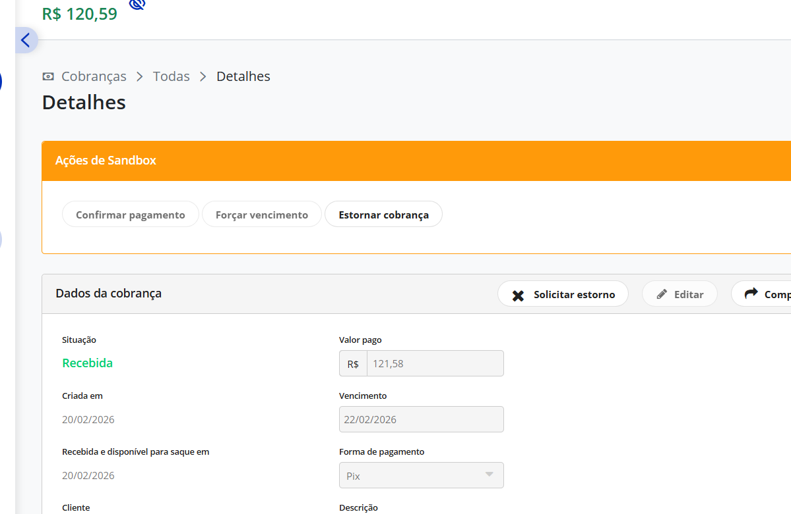

# Sprint 4 — Testes E2E contra Sandbox Asaas

## PRÉ-REQUISITOS (verificar antes de tudo)

Antes de qualquer teste, o Claude Code deve verificar se o ambiente está pronto.
Execute este diagnóstico:

```
Verificação de ambiente para testes E2E da integração Asaas.
Execute TODOS os checks abaixo e reporte o resultado de cada um:

1. SUPABASE SECRETS
   - Verificar se existem os secrets: ASAAS_API_KEY, ASAAS_BASE_URL, ASAAS_WEBHOOK_TOKEN
   - Rodar: supabase secrets list (ou verificar via MCP)
   - ASAAS_BASE_URL DEVE ser https://sandbox.asaas.com/api/v3

2. EDGE FUNCTIONS DEPLOYED
   - Listar Edge Functions deployadas
   - Confirmar que existem: create-asaas-payment, asaas-webhook, calculate-shipping
   - Verificar versão (create-asaas-payment deve ser v3)

3. SCHEMA CORRETO
   Rodar estas queries via MCP:

   -- RPCs existem?
   SELECT routine_name FROM information_schema.routines
   WHERE routine_schema = 'public'
   AND routine_name IN (
     'create_order_with_reservation',
     'confirm_order_payment',
     'cancel_order_and_release_stock',
     'process_asaas_webhook',
     'get_available_stock',
     'expire_stock_reservations'
   );

   -- Tabelas novas existem?
   SELECT table_name FROM information_schema.tables
   WHERE table_schema = 'public'
   AND table_name IN ('asaas_customers', 'webhook_logs');

   -- CHECK constraints corretas?
   SELECT conname, pg_get_constraintdef(oid) FROM pg_constraint
   WHERE conrelid = 'public.orders'::regclass AND contype = 'c';
   -- Deve incluir 'refunded' no status check e ter payment_status check

   -- Tem produto para testar?
   SELECT p.id, p.name, p.price, p.brand_id, b.slug,
          pv.id as variant_id, pv.name as variant_name, pv.stock, pv.price as variant_price
   FROM products p
   JOIN brands b ON p.brand_id = b.id
   LEFT JOIN product_variants pv ON pv.product_id = p.id
   WHERE p.active = true AND (pv.stock > 0 OR pv.id IS NULL)
   LIMIT 5;

4. CHAVE PIX NO SANDBOX
   - Verificar se existe chave PIX cadastrada na conta Sandbox Asaas
   - Sem chave PIX = erro 404 ao gerar QR Code
   - Se não tiver: acessar sandbox.asaas.com → Pix → Minhas Chaves → Cadastrar

5. WEBHOOK CONFIGURADO NO SANDBOX
   - Verificar se o webhook está configurado em sandbox.asaas.com:
     URL: https://<project-ref>.supabase.co/functions/v1/asaas-webhook
     Token de autenticação: o mesmo valor de ASAAS_WEBHOOK_TOKEN
     Eventos: todos de Cobrança (PAYMENT_*)
   - Se não estiver: configurar manualmente no painel Asaas

6. FRONTEND BUILD
   - npm run build deve passar sem erros
   - Verificar se CheckoutPage existe e tem rota configurada

Se qualquer check falhar, PARE e corrija antes de continuar.
```

---

## DADOS DE TESTE ASAAS SANDBOX

### Cartão de crédito — SUCESSO
```
Número: 4444 4444 4444 4444
Validade: qualquer mês futuro (ex: 12/2028)
CVV: 123 (ou quaisquer 3 dígitos)
Nome: TESTE APROVADO
```

### Cartão de crédito — RECUSADO
```
Mastercard: 5184 0197 4037 3151
Visa:       4916 5613 5824 0741
Validade: qualquer mês futuro
CVV: qualquer 3 dígitos
```

### CPF válido para testes
```
24971563792
(CPF de exemplo da documentação Asaas — válido pelo algoritmo)
```

### PIX no Sandbox
```
PIX no Sandbox NÃO é pago automaticamente.
Após criar a cobrança PIX:
  1. Acessar sandbox.asaas.com
  2. Ir em Cobranças
  3. Encontrar a cobrança PIX
  4. Clicar no botão "CONFIRMAR RECEBIMENTO"
  5. Isso dispara o webhook PAYMENT_RECEIVED
```

### Cartão no Sandbox
```
Cartão aprovado (HTTP 200 da API) já fica com status CONFIRMED.
No painel do Sandbox aparece o botão "RECEBER PAGAMENTO":
  - Clicar simula PAYMENT_RECEIVED (30 dias no mundo real)
  - Não é necessário para o fluxo de checkout (CONFIRMED já libera o pedido)
```

---

## FASE 1 — TESTES DE BACKEND (curl/Postman)

> Testar as Edge Functions diretamente antes de testar via frontend.
> Isso isola problemas de backend vs. frontend.

### Test 1.1 — PIX: Criar cobrança guest checkout

```bash
# Ajustar SUPABASE_URL e BRAND_SLUG conforme seu projeto
SUPABASE_URL="https://<project-ref>.supabase.co"

curl -X POST "${SUPABASE_URL}/functions/v1/create-asaas-payment" \
  -H "Content-Type: application/json" \
  -d '{
    "brand_slug": "sesh",
    "guest_info": {
      "name": "Teste PIX Guest",
      "email": "teste-pix@teste.com",
      "cpf": "24971563792",
      "phone": "21999998888"
    },
    "items": [
      {
        "product_id": "<ID_DE_UM_PRODUTO_ATIVO>",
        "variant_id": "<ID_DE_UMA_VARIANTE_COM_STOCK>",
        "quantity": 1
      }
    ],
    "shipping_address": {
      "recipient_name": "Teste PIX",
      "cep": "24210470",
      "street": "Rua Lopes Trovão",
      "number": "100",
      "complement": "Apto 301",
      "neighborhood": "Icaraí",
      "city": "Niterói",
      "state": "RJ"
    },
    "shipping": {
      "service_code": "04014",
      "service_name": "SEDEX",
      "cost": 23.50,
      "delivery_days": 3
    },
    "payment": {
      "method": "pix"
    }
  }'
```

**Resultado esperado:**
```json
{
  "success": true,
  "order_id": "uuid-aqui",
  "order_number": "SESH-2026-XXXX",
  "payment_method": "pix",
  "pix": {
    "qr_code_base64": "iVBORw0KGgo...",
    "payload": "00020126...",
    "expiration_date": "..."
  }
}
```

**Validar no banco:**
```sql
-- Pedido criado com dados corretos?
SELECT id, order_number, status, payment_status, payment_method,
       customer_name, customer_cpf, total, shipping_cost,
       asaas_payment_id, payment_metadata
FROM orders
WHERE id = '<order_id_retornado>';
-- Esperado: status='pending', payment_status='pending', asaas_payment_id preenchido

-- Order items criados?
SELECT * FROM order_items WHERE order_id = '<order_id>';

-- Estoque reservado?
SELECT * FROM stock_reservations WHERE order_id = '<order_id>';
-- Esperado: status='pending', reserved_until ~15min no futuro

-- Customer Asaas criado?
SELECT * FROM asaas_customers WHERE cpf_cnpj = '24971563792';
```

### Test 1.2 — Cartão 1x (à vista): Guest checkout

```bash
curl -X POST "${SUPABASE_URL}/functions/v1/create-asaas-payment" \
  -H "Content-Type: application/json" \
  -d '{
    "brand_slug": "sesh",
    "guest_info": {
      "name": "Teste Cartao Avista",
      "email": "teste-card@teste.com",
      "cpf": "24971563792",
      "phone": "21999997777"
    },
    "items": [
      {
        "product_id": "<PRODUCT_ID>",
        "variant_id": "<VARIANT_ID>",
        "quantity": 1
      }
    ],
    "shipping_address": {
      "recipient_name": "Teste Cartao",
      "cep": "24210470",
      "street": "Rua Lopes Trovão",
      "number": "200",
      "neighborhood": "Icaraí",
      "city": "Niterói",
      "state": "RJ"
    },
    "shipping": {
      "service_code": "04014",
      "service_name": "SEDEX",
      "cost": 23.50,
      "delivery_days": 3
    },
    "payment": {
      "method": "credit_card",
      "credit_card": {
        "holder_name": "TESTE APROVADO",
        "number": "4444444444444444",
        "expiry_month": "12",
        "expiry_year": "2028",
        "ccv": "123"
      },
      "credit_card_holder_info": {
        "name": "Teste Cartao Avista",
        "email": "teste-card@teste.com",
        "cpf_cnpj": "24971563792",
        "postal_code": "24210470",
        "address_number": "200",
        "phone": "21999997777",
        "mobile_phone": "21999997777"
      },
      "installments": 1
    }
  }'
```

**Resultado esperado:**
```json
{
  "success": true,
  "order_id": "uuid",
  "order_number": "SESH-2026-XXXX",
  "payment_method": "credit_card",
  "status": "CONFIRMED"
}
```

**Validar no banco:**
```sql
SELECT id, status, payment_status, payment_method, paid_at,
       asaas_payment_id, installments, payment_metadata
FROM orders WHERE id = '<order_id>';
-- Esperado: status='processing', payment_status='confirmed', paid_at preenchido
-- (A Edge Function chama confirm_order_payment imediatamente para cartão aprovado)

SELECT status FROM stock_reservations WHERE order_id = '<order_id>';
-- Esperado: status='confirmed'
```

### Test 1.3 — Cartão parcelado (3x)

```bash
curl -X POST "${SUPABASE_URL}/functions/v1/create-asaas-payment" \
  -H "Content-Type: application/json" \
  -d '{
    "brand_slug": "sesh",
    "guest_info": {
      "name": "Teste Parcelado",
      "email": "teste-parcelado@teste.com",
      "cpf": "24971563792",
      "phone": "21999996666"
    },
    "items": [
      {
        "product_id": "<PRODUCT_ID>",
        "variant_id": "<VARIANT_ID>",
        "quantity": 2
      }
    ],
    "shipping_address": {
      "recipient_name": "Teste Parcelado",
      "cep": "24210470",
      "street": "Rua Lopes Trovão",
      "number": "300",
      "neighborhood": "Icaraí",
      "city": "Niterói",
      "state": "RJ"
    },
    "shipping": {
      "service_code": "04510",
      "service_name": "PAC",
      "cost": 15.90,
      "delivery_days": 8
    },
    "payment": {
      "method": "credit_card",
      "credit_card": {
        "holder_name": "TESTE PARCELADO",
        "number": "4444444444444444",
        "expiry_month": "06",
        "expiry_year": "2029",
        "ccv": "456"
      },
      "credit_card_holder_info": {
        "name": "Teste Parcelado",
        "email": "teste-parcelado@teste.com",
        "cpf_cnpj": "24971563792",
        "postal_code": "24210470",
        "address_number": "300",
        "phone": "21999996666",
        "mobile_phone": "21999996666"
      },
      "installments": 3
    }
  }'
```

**Validar:**
```sql
SELECT installments, total, payment_metadata->>'asaas_billing_type' as billing_type
FROM orders WHERE id = '<order_id>';
-- Esperado: installments=3, billing_type='CREDIT_CARD'
-- Verificar que installmentValue no metadata ≈ total/3
```

### Test 1.4 — Cartão RECUSADO

```bash
curl -X POST "${SUPABASE_URL}/functions/v1/create-asaas-payment" \
  -H "Content-Type: application/json" \
  -d '{
    "brand_slug": "sesh",
    "guest_info": {
      "name": "Teste Recusado",
      "email": "teste-recusado@teste.com",
      "cpf": "24971563792",
      "phone": "21999995555"
    },
    "items": [
      {
        "product_id": "<PRODUCT_ID>",
        "variant_id": "<VARIANT_ID>",
        "quantity": 1
      }
    ],
    "shipping_address": {
      "recipient_name": "Teste Recusado",
      "cep": "24210470",
      "street": "Rua Lopes Trovão",
      "number": "400",
      "neighborhood": "Icaraí",
      "city": "Niterói",
      "state": "RJ"
    },
    "shipping": {
      "service_code": "04014",
      "service_name": "SEDEX",
      "cost": 23.50,
      "delivery_days": 3
    },
    "payment": {
      "method": "credit_card",
      "credit_card": {
        "holder_name": "TESTE RECUSADO",
        "number": "5184019740373151",
        "expiry_month": "12",
        "expiry_year": "2028",
        "ccv": "123"
      },
      "credit_card_holder_info": {
        "name": "Teste Recusado",
        "email": "teste-recusado@teste.com",
        "cpf_cnpj": "24971563792",
        "postal_code": "24210470",
        "address_number": "400",
        "phone": "21999995555",
        "mobile_phone": "21999995555"
      },
      "installments": 1
    }
  }'
```

**Resultado esperado:**
```json
{
  "success": false,
  "error": {
    "code": "CARD_DECLINED",
    "message": "..."
  }
}
```

**Validar no banco:**
```sql
-- O pedido foi criado e depois cancelado (rollback)?
SELECT id, status, payment_status FROM orders
WHERE customer_name = 'Teste Recusado'
ORDER BY created_at DESC LIMIT 1;
-- Esperado: status='cancelled', payment_status='cancelled'
-- Ou: pedido nem foi criado (se Edge Function cancela antes)

-- Estoque foi liberado?
SELECT * FROM stock_reservations
WHERE order_id = '<order_id_se_existir>';
-- Esperado: status='cancelled' OU não existe
```

### Test 1.5 — Webhook: Simular PAYMENT_RECEIVED (PIX)

Após o Test 1.1, o pedido PIX está com status='pending'. Agora simular o webhook:

**Opção A (recomendada): Via painel Sandbox**
1. Acessar sandbox.asaas.com
2. Ir em Cobranças
3. Encontrar a cobrança PIX do Test 1.1
4. Clicar "CONFIRMAR RECEBIMENTO"
5. O Asaas envia webhook automaticamente para sua URL

**Opção B: Simular manualmente via curl**
```bash
# Pegar o ASAAS_WEBHOOK_TOKEN configurado e o asaas_payment_id do Test 1.1

curl -X POST "${SUPABASE_URL}/functions/v1/asaas-webhook" \
  -H "Content-Type: application/json" \
  -H "asaas-access-token: <ASAAS_WEBHOOK_TOKEN>" \
  -d '{
    "id": "evt_test_pix_001",
    "event": "PAYMENT_RECEIVED",
    "payment": {
      "id": "<ASAAS_PAYMENT_ID_DO_TEST_1.1>",
      "status": "RECEIVED",
      "netValue": 80.00,
      "billingType": "PIX"
    }
  }'
```

**Validar no banco:**
```sql
-- Pedido atualizado?
SELECT status, payment_status, paid_at FROM orders
WHERE asaas_payment_id = '<asaas_payment_id>';
-- Esperado: status='processing', payment_status='received', paid_at preenchido

-- Webhook logado?
SELECT * FROM webhook_logs WHERE asaas_payment_id = '<asaas_payment_id>';
-- Esperado: processed=true

-- Estoque confirmado?
SELECT status FROM stock_reservations
WHERE order_id = '<order_id>';
-- Esperado: status='confirmed'
```

### Test 1.6 — Webhook: Idempotência (enviar duplicado)

Reenviar exatamente o mesmo curl do Test 1.5 com o mesmo `event_id`:

```bash
# Mesmo payload exato do Test 1.5
curl -X POST "${SUPABASE_URL}/functions/v1/asaas-webhook" \
  -H "Content-Type: application/json" \
  -H "asaas-access-token: <ASAAS_WEBHOOK_TOKEN>" \
  -d '{
    "id": "evt_test_pix_001",
    "event": "PAYMENT_RECEIVED",
    "payment": {
      "id": "<ASAAS_PAYMENT_ID>",
      "status": "RECEIVED",
      "netValue": 80.00,
      "billingType": "PIX"
    }
  }'
```

**Resultado esperado:** HTTP 200 (sem erro), mas nenhuma mudança no banco.
```sql
-- Deve ter apenas 1 registro (não duplicou)
SELECT COUNT(*) FROM webhook_logs WHERE event_id = 'evt_test_pix_001';
-- Esperado: 1
```

### Test 1.7 — Webhook: Token inválido

```bash
curl -X POST "${SUPABASE_URL}/functions/v1/asaas-webhook" \
  -H "Content-Type: application/json" \
  -H "asaas-access-token: TOKEN_ERRADO_123" \
  -d '{
    "id": "evt_test_bad_token",
    "event": "PAYMENT_RECEIVED",
    "payment": { "id": "pay_fake", "status": "RECEIVED" }
  }'
```

**Resultado esperado:** HTTP 401 Unauthorized.

### Test 1.8 — CPF inválido

```bash
curl -X POST "${SUPABASE_URL}/functions/v1/create-asaas-payment" \
  -H "Content-Type: application/json" \
  -d '{
    "brand_slug": "sesh",
    "guest_info": {
      "name": "CPF Invalido",
      "email": "cpf-invalido@teste.com",
      "cpf": "11111111111",
      "phone": "21999994444"
    },
    "items": [{ "product_id": "<ID>", "variant_id": "<ID>", "quantity": 1 }],
    "shipping_address": { "recipient_name": "X", "cep": "24210470", "street": "R", "number": "1", "neighborhood": "I", "city": "N", "state": "RJ" },
    "shipping": { "service_code": "X", "service_name": "X", "cost": 10, "delivery_days": 3 },
    "payment": { "method": "pix" }
  }'
```

**Resultado esperado:**
```json
{ "success": false, "error": { "code": "INVALID_CPF", "message": "..." } }
```

### Test 1.9 — Estoque insuficiente

```bash
# Usar um variant com stock=1 e pedir quantity=999
curl -X POST "${SUPABASE_URL}/functions/v1/create-asaas-payment" \
  -H "Content-Type: application/json" \
  -d '{
    "brand_slug": "sesh",
    "guest_info": {
      "name": "Sem Estoque",
      "email": "sem-estoque@teste.com",
      "cpf": "24971563792",
      "phone": "21999993333"
    },
    "items": [{ "product_id": "<ID>", "variant_id": "<ID_LOW_STOCK>", "quantity": 999 }],
    "shipping_address": { "recipient_name": "X", "cep": "24210470", "street": "R", "number": "1", "neighborhood": "I", "city": "N", "state": "RJ" },
    "shipping": { "service_code": "X", "service_name": "X", "cost": 10, "delivery_days": 3 },
    "payment": { "method": "pix" }
  }'
```

**Resultado esperado:**
```json
{ "success": false, "error": { "code": "INSUFFICIENT_STOCK" | "OUT_OF_STOCK", "message": "..." } }
```

### Test 1.10 — Cupom (se existir cupom ativo)

```bash
# Adicionar "coupon_code": "PROMO10" (ou o que existir) ao payload do Test 1.1
# Verificar que o desconto foi aplicado no total
# Verificar coupon_uses incrementou
```

---

## FASE 2 — TESTES DE FRONTEND (Manual no Browser)

> Após validar backend via curl, testar o checkout completo no browser.
> Usar npm run dev e navegar para o checkout.

### Checklist por cenário

#### F2.1 — Guest Checkout + PIX
```
[ ] Navegar para a loja, adicionar item ao carrinho
[ ] Clicar "Finalizar Compra"
[ ] Verificar redirect para /:brand/checkout
[ ] Step 1: Preencher dados guest
    [ ] CPF com máscara funciona (xxx.xxx.xxx-xx)
    [ ] CPF inválido mostra erro em tempo real
    [ ] Telefone com máscara funciona
    [ ] Email com validação
    [ ] "Entrar" abre LoginModal
    [ ] "Continuar" avança para Step 2
[ ] Step 2: Preencher endereço
    [ ] CEP busca endereço automaticamente (ViaCEP)
    [ ] Campos auto-preenchidos após CEP
    [ ] Timeout de ViaCEP mostra mensagem amigável (testar com CEP inexistente)
    [ ] Frete é calculado automaticamente após endereço completo
    [ ] Opções de frete aparecem com preço e prazo
    [ ] Frete grátis aparece se subtotal >= threshold
    [ ] Selecionar opção de frete e avançar
[ ] Step 3: Selecionar PIX
    [ ] Toggle PIX / Cartão funciona
    [ ] PIX selecionado: nenhum campo adicional
    [ ] Avançar para Step 4
[ ] Step 4: Revisar pedido
    [ ] Items corretos (imagem, nome, variante, qtd, preço)
    [ ] Endereço correto
    [ ] Frete correto
    [ ] Método de pagamento: PIX
    [ ] Total = subtotal + frete - desconto
    [ ] Botão "Gerar PIX"
    [ ] Clicar → loading state → botão desabilitado
[ ] PIX View:
    [ ] QR Code renderiza corretamente
    [ ] Botão "Copiar código PIX" funciona (clipboard)
    [ ] Timer regressivo visível
    [ ] Texto "Aguardando pagamento..."
    [ ] Ir no sandbox.asaas.com → Confirmar pagamento
    [ ] Frontend detecta pagamento (Realtime ou polling)
    [ ] Redirect para OrderConfirmationPage
[ ] Order Confirmation:
    [ ] Mostra número do pedido
    [ ] Mostra "Pagamento Confirmado"
    [ ] Carrinho foi limpo
```

#### F2.2 — Guest Checkout + Cartão 1x
```
[ ] Adicionar item ao carrinho → Checkout
[ ] Step 1: Preencher dados guest
[ ] Step 2: Endereço + frete
[ ] Step 3: Selecionar Cartão
    [ ] Número: usar 4444 4444 4444 4444
    [ ] Máscara de número funciona (#### #### #### ####)
    [ ] Bandeira VISA detectada e exibida
    [ ] Nome: TESTE APROVADO (auto-uppercase)
    [ ] Validade: 12/28 (máscara MM/AA)
    [ ] CVV: 123
    [ ] CPF pré-preenchido do Step 1
    [ ] Parcelas: 1x selecionado por default
[ ] Step 4: Revisar → "Pagar R$ XX,XX"
    [ ] Loading state durante request
    [ ] Sucesso → redirect para OrderConfirmationPage
[ ] Order Confirmation:
    [ ] Mostra "Pagamento Aprovado"
    [ ] Mostra VISA •••• 4444
    [ ] Carrinho limpo
```

#### F2.3 — Guest Checkout + Cartão Parcelado (3x)
```
[ ] Mesmo fluxo de F2.2, mas:
    [ ] No Step 3: selecionar 3x no dropdown
    [ ] Verificar que opcões mostram "3x de R$ XX,XX sem juros"
    [ ] Parcela mínima R$ 5,00 respeitada
    [ ] Step 4: resumo mostra "3x de R$ XX,XX"
    [ ] Confirmar → sucesso → confirmation mostra parcelas
```

#### F2.4 — Cartão RECUSADO
```
[ ] Checkout com cartão 5184 0197 4037 3151
[ ] Step 4: Confirmar → erro
    [ ] Mensagem amigável: "O pagamento não foi autorizado..."
    [ ] Botão habilita novamente para tentar outro cartão
    [ ] NÃO redirecionar para confirmation
    [ ] Voltar para Step 3 com dados preservados
```

#### F2.5 — Logged In Checkout
```
[ ] Fazer login antes do checkout
[ ] Step 1:
    [ ] Dados pré-preenchidos do perfil (nome, CPF, email, tel)
    [ ] Opção "Editar" funciona
[ ] Step 2:
    [ ] Endereços salvos aparecem (radio select)
    [ ] "Usar outro endereço" abre form
    [ ] Frete calcula para endereço selecionado
[ ] Step 3 e 4: mesmo fluxo
[ ] Verificar que auth_token é enviado (não guest_info)
```

#### F2.6 — Cupom
```
[ ] Ter um cupom ativo no banco
[ ] No CheckoutSummary: inserir código do cupom
[ ] Desconto aparece no resumo
[ ] Total recalculado
[ ] Cupom inválido/expirado: mensagem de erro
```

#### F2.7 — Edge Cases
```
[ ] Checkout com carrinho vazio → redirect para loja
[ ] Checkout abaixo do pedido mínimo → aviso MinOrderValue
[ ] Navegar para trás entre steps → dados preservados
[ ] Refresh da página durante checkout → estado resetado (não persistido)
[ ] Mobile: todos os steps funcionam em tela pequena
[ ] Mobile: sidebar vira collapsible
[ ] Timer de reserva visível e funcional
```

---

## FASE 3 — VERIFICAÇÕES DE SEGURANÇA

Execute manualmente:

```
[ ] Abrir DevTools → Application → Local Storage
    Nenhum dado de cartão deve estar presente

[ ] Abrir DevTools → Console
    Nenhum número de cartão ou CVV nos logs

[ ] Abrir DevTools → Network → filtrar pelo request create-asaas-payment
    Request body contém dados do cartão (esperado — HTTPS obrigatório)
    Response NÃO contém número completo do cartão (só last4)

[ ] Tentar acessar Edge Function sem CORS adequado
    Verificar que só o domínio da loja é aceito

[ ] Verificar que asaas_payment_id NÃO aparece no frontend
    (Isso é dado interno, só backend)
```

---

## FASE 4 — VERIFICAÇÃO DE CONSISTÊNCIA DO BANCO

Após todos os testes, rodar queries de sanidade:

```sql
-- 1. Pedidos sem asaas_payment_id (bug se payment_status != 'cancelled')
SELECT id, order_number, status, payment_status, asaas_payment_id
FROM orders
WHERE asaas_payment_id IS NULL AND payment_status != 'cancelled'
AND status != 'cancelled';
-- Esperado: 0 rows

-- 2. Reservas de estoque órfãs (sem pedido correspondente)
SELECT sr.id, sr.order_id, o.id as order_exists
FROM stock_reservations sr
LEFT JOIN orders o ON o.id = sr.order_id
WHERE o.id IS NULL;
-- Esperado: 0 rows

-- 3. Pedidos pagos sem estoque confirmado
SELECT o.id, o.order_number, o.payment_status, sr.status as reservation_status
FROM orders o
LEFT JOIN stock_reservations sr ON sr.order_id = o.id
WHERE o.payment_status IN ('confirmed', 'received')
AND (sr.status IS NULL OR sr.status != 'confirmed');
-- Esperado: 0 rows

-- 4. Estoque negativo (nunca deveria acontecer)
SELECT id, name, stock, reserved_stock
FROM product_variants
WHERE stock < 0 OR reserved_stock < 0;
-- Esperado: 0 rows

-- 5. Webhooks não processados
SELECT id, event_id, event_type, asaas_payment_id, processing_error
FROM webhook_logs
WHERE processed = false;
-- Esperado: 0 rows (ou com processing_error explicável)

-- 6. Customer Asaas duplicados por CPF
SELECT cpf_cnpj, COUNT(*) as qty
FROM asaas_customers
GROUP BY cpf_cnpj
HAVING COUNT(*) > 1;
-- Esperado: 0 rows (UNIQUE index garante)

-- 7. Pedidos com payment_status inválido (CHECK deveria pegar)
SELECT id, payment_status FROM orders
WHERE payment_status NOT IN ('pending','confirmed','received','overdue','refunded','chargeback','cancelled');
-- Esperado: 0 rows
```

---

## FASE 5 — WEBHOOK LIFECYCLE COMPLETO (PIX)

Testar o ciclo de vida completo de um pedido PIX:

```
1. Criar pedido PIX (Test 1.1) → status='pending', payment_status='pending'
2. Confirmar no Sandbox → webhook PAYMENT_RECEIVED → status='processing', payment_status='received'
3. (Opcional) Estornar no Sandbox → webhook PAYMENT_REFUNDED → status='refunded', payment_status='refunded'
   Verificar: estoque voltou? stock_reservations='cancelled'?
```

---

## PROMPT PARA CLAUDE CODE

```
Execute a Fase 1 dos testes E2E da integração Asaas.

PRIMEIRO: Rode o diagnóstico de pré-requisitos (início do documento).
Se qualquer check falhar, corrija antes de prosseguir.

DEPOIS: Para cada teste de 1.1 a 1.10:
1. Adaptar os IDs de produto/variante para os que existem no banco
2. Executar o curl
3. Verificar a resposta
4. Rodar as queries SQL de validação
5. Reportar PASS ou FAIL com detalhes

Se qualquer teste falhar, PARE e analise a causa raiz antes de continuar.
Priorize entender o erro do Asaas (HTTP status, body da resposta) e cruzar
com os logs da Edge Function (supabase functions logs create-asaas-payment).

Cartões de teste:
- Sucesso: 4444 4444 4444 4444, qualquer data futura, CVV 123
- Erro: 5184019740373151 (Mastercard) ou 4916561358240741 (Visa)
- CPF válido: 24971563792

PIX: Após criar cobrança, confirmar manualmente em sandbox.asaas.com
(Cobranças → encontrar a cobrança → CONFIRMAR RECEBIMENTO)
```

---

## RESULTADO ESPERADO

Ao final de todos os testes, ter confiança de que:
- PIX cria cobrança, gera QR Code, webhook confirma pagamento, estoque é decrementado
- Cartão 1x aprova na hora, confirm_order_payment executa, estoque confirmado
- Cartão parcelado funciona com installmentCount correto
- Cartão recusado retorna erro amigável e faz rollback
- Webhook é idempotente (duplicatas ignoradas)
- Webhook rejeita token inválido
- CPF inválido é rejeitado antes de criar pedido
- Estoque insuficiente é rejeitado antes de criar cobrança
- Banco está consistente (sem órfãos, sem estoque negativo, sem duplicatas)
